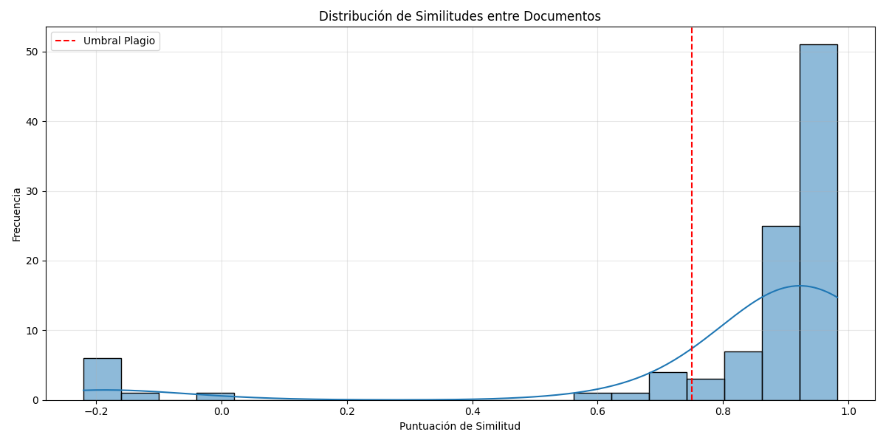
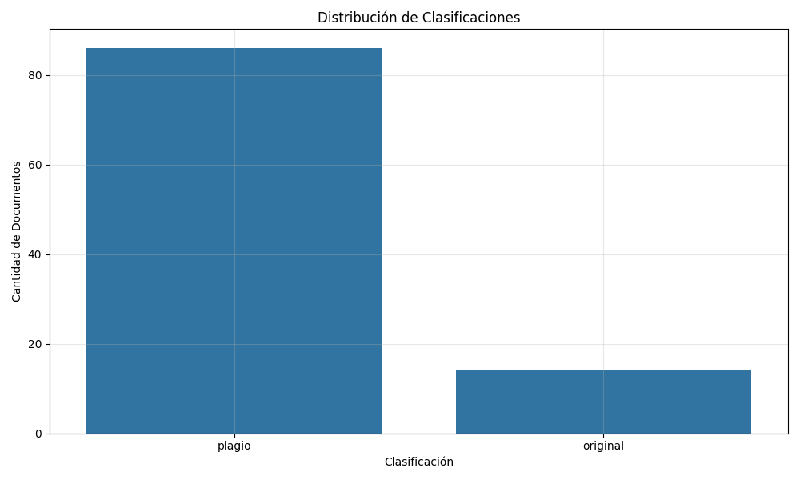
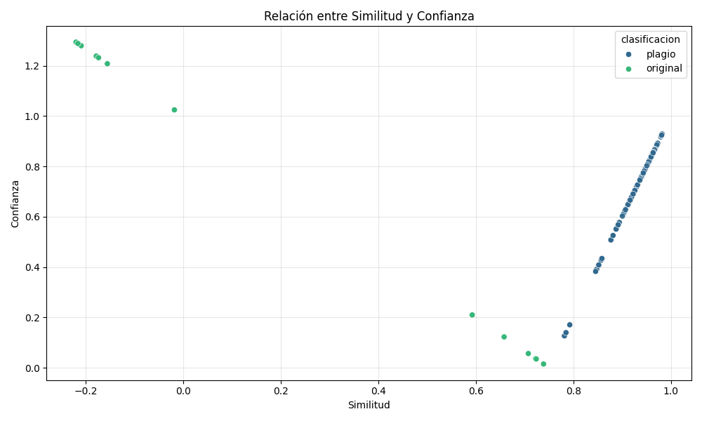

# Detección de Plagio mediante Embeddings Semánticos con BERT

Este trabajo fue realizado por un equipo de tres personas, cada una explorando diferentes modelos de embeddings. Esta documentación se centra en los resultados obtenidos utilizando el modelo NNLM.

## Introducción

- Para esta versión se exploró NNLM(Nerual Network Language Model): NNLM es un modelo de red neuronal entrenado para predecir la probabilidad de una palabra dada su contexto anterior, utilizando una arquitectura de red neuronal simple y eficiente. A diferencia de modelos como BERT, NNLM genera representaciones no contextuales, lo que significa que una misma palabra tendrá siempre la misma representación, independientemente del contexto. Sin embargo, su eficiencia lo convierte en una herramienta útil para tareas como clasificación de texto o detección rápida de similitud. NNLM genera vectores densos y de tamaño fijo a partir de texto, lo que permite comparar fácilmente frases o documentos mediante medidas como la similitud del coseno.

## Metodología

### Selección de Datos

Para el desarrollo y evaluación de este modelo de detección de plagio, se utilizó el conjunto de datos "Dokumen Teks", disponible públicamente en Kaggle ([Plagiarism Document Text](https://www.kaggle.com/datasets/fajarpanaungi/plagiarism-document-text)). Este conjunto de datos está estructurado en dos carpetas principales:

1.  **Original**: Contiene los documentos fuente que sirven como referencia.
2.  **Copy**: Contiene documentos que son versiones modificadas o copias de los documentos originales, diseñados para simular diferentes escenarios de plagio o similitud.

La elección de este conjunto de datos se basa en su estructura clara, que permite una comparación directa por pares entre un documento original y su correspondiente versión sospechosa. Esto facilita la evaluación del modelo en su tarea principal: determinar el grado de similitud entre dos textos específicos.

### Análisis de Datos

El análisis de los datos se realizó mediante las siguientes técnicas:

1.  **Preprocesamiento textual**:

    - Normalización de espacios
    - Eliminación de caracteres especiales (conservando alfanuméricos y espacios)
    - Conversión a minúsculas

2.  **Análisis exploratorio**:

    - Evaluación de la longitud de los textos para entender la variabilidad en el dataset.
    - Identificación de patrones comunes entre textos con alta similitud (e.g., secuencias de palabras idénticas).
    - Análisis de la distribución de palabras para identificar vocabulario clave y posibles sinónimos utilizados en las copias.

3.  **Herramientas utilizadas**:
    - Python como lenguaje principal para el desarrollo y análisis.
    - Bibliotecas: NumPy para operaciones numéricas, Pandas para la manipulación y análisis de datos tabulares.
    - Matplotlib y Seaborn para la creación de visualizaciones que ayuden a entender la distribución de los datos y los resultados.
    - TensorFlow y TensorFlow Hub para la integración y uso del modelo de embeddings semánticos.

El análisis exploratorio reveló que los textos clasificados con alta similitud a menudo conservan fragmentos extensos del texto original. Los textos con similitud media presentan una mayor variación, incluyendo parafraseo y sustitución de palabras, manteniendo sin embargo el significado central. Los textos con baja similitud generalmente abordan el mismo tema pero con un contenido y una estructura significativamente diferentes.

### Construcción del Modelo

1.  **Selección del modelo de embeddings**:

    - Se eligió el  NNLM(Nerual Network Language Model)

2.  **Implementación del pipeline de procesamiento**:

    - Carga de pares de archivos (original y sospechoso) desde las carpetas "Original" y "Copy" del dataset "Dokumen Teks", emparejándolos por un identificador común en sus nombres de archivo.
    - Preprocesamiento de textos utilizando la función `preprocess_text` para normalizar espacios, eliminar caracteres no alfanuméricos y convertir el texto a minúsculas, lo que ayuda a enfocar el análisis en el contenido semántico.
    - Generación de embeddings semánticos para cada texto del par utilizando la función `obtener_embeddings_semanticos`, la cual carga el modelo BERT y aplica la transformación a los textos preprocesados.
    - Cálculo de la similitud coseno entre los vectores de embeddings del par de textos utilizando la función `cosine_similarity` de scikit-learn. Esta métrica proporciona una medida de la similitud en el espacio vectorial de los embeddings.
    - Clasificación del resultado basada en los umbrales definidos en la configuración (`CONFIG['similitud']['umbral_plagio'] = 0.75`) utilizando la función `clasificar_similitud`.

3.  **Definición de umbrales y clasificación**:
    Se establecieron los siguientes umbrales para clasificar la similitud entre un texto original y uno sospechoso, basados en la literatura revisada que sugiere umbrales altos para indicar plagio de manera fiable:

    - **Plagio**: Similitud coseno ≥ 0.75
    - **Original**: Similitud coseno < 0.75
      Además, se calcula un nivel de confianza para cada clasificación, indicando qué tan lejos o cerca está la similitud del umbral de plagio. La confianza para la clasificación de plagio se calcula como `(sim - umbral) / (1 - umbral)`, y para la clasificación de original como `1 - (sim / umbral)`.

4.  **Evaluación y ajuste (Pendiente)**:
    - La evaluación del modelo con textos etiquetados y el ajuste de umbrales para optimizar la precisión se realizarán en etapas posteriores, una vez que se hayan obtenido los resultados iniciales. El análisis de errores se llevará a cabo para identificar los tipos de plagio que el modelo detecta con mayor o menor eficacia.

## Resultados

### Presentación de Hallazgos

Dado que el dataset "Dokumen Teks" no cuenta con etiquetas verdaderas que indiquen si un par de documentos representa plagio o contenido original, no es posible aplicar métricas de clasificación supervisada tradicionales como precisión, F1-score o recall. En su lugar, se utilizaron métricas de clustering y análisis de similitud para evaluar el rendimiento del modelo NNLM (Neural Network Language Model) en la tarea de detección de plagio.
Estas métricas permiten analizar cómo se agrupan los documentos en función de sus características semánticas, en este caso, los valores de similitud calculados por el modelo. Una buena agrupación sugiere que el modelo es capaz de capturar relaciones relevantes entre los textos, incluso sin contar con una "ground truth".

- **Silhouette Coefficient:** Mide la coherencia interna de los clusters generados. El valor obtenido fue 0.7098, lo que indica una buena separación entre los grupos de documentos clasificados como "plagio" y "original". Este valor, cercano a 1, sugiere que los documentos están bien agrupados y definidos dentro de sus respectivos clusters.

- **Pureza del Cluster (K-means):** Se alcanzó una pureza de 0.94, lo cual indica que la mayoría de los documentos dentro de cada cluster pertenecen a la misma categoría. Esta alta pureza demuestra que el modelo NNLM fue muy efectivo para identificar patrones que separan claramente los casos de posible plagio de los documentos originales.

- **Ganancia de Información:** El valor de 0.183 muestra una reducción moderada en la incertidumbre sobre la clase (plagio u original) al observar la asignación de los documentos a los clusters. Aunque no es extremadamente alta, esta ganancia es significativa y muestra que la estructura del clustering aporta valor al análisis.

- **Resultados NNLM:**

  - **Análisis de Similitudes:**
  - - **Similitud media global:** 0.82
  - - **Similitud Media en documentos clasificados como plagio:** 0.92
  - - **Similitud Media en documentos clasificados como originales:** 0.19
  - La diferencia entre los niveles de similitud en cada clase es notoria. Los documentos detectados como plagio presentan similitudes muy altas entre sí, con una desviación estándar baja (0.04), lo que sugiere consistencia en la detección. En contraste, los documentos clasificados como originales tienen una similitud mucho más baja y dispersa, con una desviación estándar alta (0.44), lo cual es esperable si el modelo está capturando correctamente las diferencias semánticas.

- **Visualizaciones:**
  - **Histograma de distribución de similitudes:** Muestra una clara separación entre los documentos clasificados como plagio, cuyas similitudes se concentran en rangos altos (por encima de 0.9), y los originales, cuya distribución se extiende a valores bajos, incluso negativos. Esto indica una segmentación efectiva.
    
  - **Gráfico de barras por clasificación:** La distribución muestra que 86 documentos (86%) fueron clasificados como plagio y 14 documentos (14%) como originales. Aunque el número de casos de plagio parece alto, la separación estadística entre ambos grupos lo respalda.
    
  - **Scatter plot de similitud vs confianza:** Los documentos agrupados como plagio forman un bloque compacto de alta similitud, mientras que los originales están más dispersos y alejados de este grupo.
    

Los resultados con el modelo NNLM indican una mayor capacidad para separar los documentos en categorías distintas en comparación con lo esperado para modelos que no fueron entrenados específicamente para detección de plagio. La alta pureza del clustering y el coeficiente de Silhouette demuestran que el modelo logró generar embeddings efectivos que permiten una separación clara entre textos similares (potencial plagio) y distintos (originales).

El modelo logra destacar los casos de similitud alta de manera consistente, haciendo que el criterio de clasificación por umbral (0.75) funcione de forma robusta en este contexto. La marcada diferencia en la similitud media entre ambas clases refuerza la idea de que el modelo NNLM, aun sin supervisión directa, puede ser útil para tareas de detección semántica como el plagio.

---

## Conclusiones

El análisis del modelo NNLM sobre el dataset "Dokumen Teks" demuestra que, con una configuración adecuada y un umbral de similitud de 0.75, este tipo de embeddings semánticos pueden ser útiles para la detección de plagio. El modelo logró una clara separación entre documentos potencialmente plagiados y originales, respaldada por métricas sólidas como un Silhouette Coefficient de 0.7098 y una pureza de cluster del 94%.

La principal fortaleza de NNLM en este análisis fue su capacidad de agrupar consistentemente los documentos similares, con un bajo nivel de ambigüedad en los casos de plagio. Esto sugiere que modelos ligeros como NNLM pueden ser una alternativa eficiente en contextos donde no se cuenta con etiquetas, pero se busca encontrar patrones semánticos robustos.

Las limitaciones del estudio incluyen la aplicación sobre un único dataset, el uso de un umbral general para todos los modelos y la falta de validación externa. Sin embargo, los resultados obtenidos constituyen una base sólida para comparaciones futuras y para seguir refinando estrategias de detección con distintos modelos de lenguaje.

En resumen, NNLM demostró ser una herramienta efectiva en el análisis semántico de similitud textual, con un rendimiento destacable en tareas de clustering sin supervisión para la detección de posibles casos de plagio.

